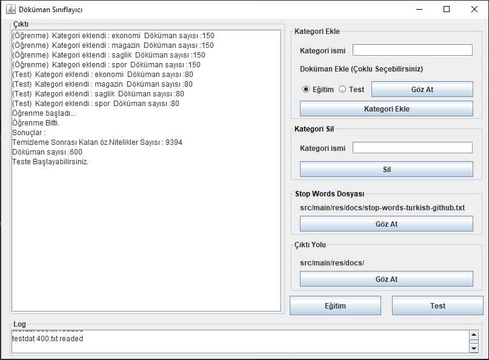
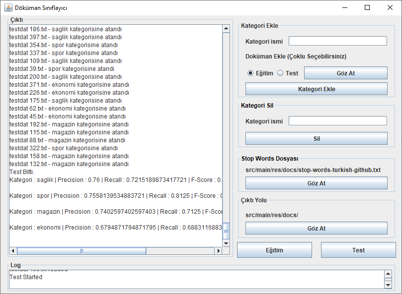

# DocumentClassifier
Turkish Document classifier app example with KNN Algorithm and cosine similarity metric
Tükçe döküman sınıflayıcı örneği. KNN algoritması ve kosinüs benzerlik metriği kullanıldı. 

Intellij idea IDE kullanıldı.

Java 8 deki lambda operator ve Stream API deki stream collector kullanıldığı için Java 8 gereklidir.

Tokenization ve Stemming işlemleri için Zemberek Kütüphanesinden yardım alındı.

